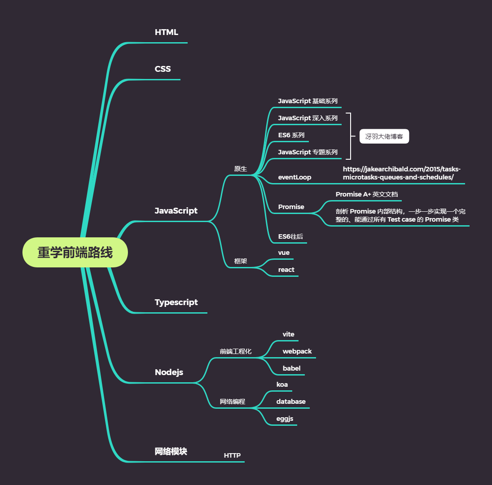

# 刘俊平的博客

> 自我介绍
>
> Hello,我是刘俊平,因为疫情而转行,成为了一个小码农,进入了之前一直都觉得很难,自身绝对无法参与的这个 `IT` 行业,果然,没什么事情是绝对的啊
>
> 刚接触的时候,不知道什么是前端后端,网上推荐前端好入门,就学了前端, 哈哈,这就是个坑
>
> 不知道怎么回事,我接受前端知识还是很快的 `HTML` `CSS` `JavaScript` ,都是能够掌握的比较好,跟一起的转行学习的小伙伴,我都是帮助他们解决问题的,哈哈
>
> 不过为了找工作,学了很多东西,也都是学了些基础,去了公司,发现自己学的还是不错的,有的前端同事,工作两三年,懂得还没我多,慢慢的,认识更多之后,我希望能前往更好的平台,见识更宽广的前端世界,也就是我想进大厂的念想出来了
>
> 为了进大厂,那学习肯定少不了,我开始学习更多的东西,看了好多文章,博客,然后越学越感觉自己好菜哦~~~,哈哈,能咋办呢,努力呗
>
> 这自己慢慢搞,太慢了,每天工作＋学习,哪有那么多时间,关键是自己的学习路线也没制定,只有一个想法,每天乱学,终究是渐行渐远,逐步消费积极性,自从看了《吃掉那只青蛙》,这种工作效率,高效的这种书,觉得,确实应该为自己规划一下啊,不能当无头苍蝇不是
>
> 从现在开始,巩固自己的基础,不要好高骛远,老想着短期效应,而忘记了长期积累,不是一通乱学,就牛的

## 学习路线

- HTML
- CSS
- JavaScript
- Http

慢慢补充,其中`html` `css` `http` 处于工作和自身需要,优先级低于 `js` , 所以先学习 `js`,其余两项后面补充

## JavaScript 基础系列

1. [JavaScript 基础系列之数据类型](./src/javascript/基础系列/JavaScript 基础系列之数据类型.md)
2. [JavaScript 基础系列之 typeof](./src/javascript/基础系列/JavaScript 基础系列之 typeof.md)
3. [JavaScript 基础系列之判断数组](./src/javascript/基础系列/JavaScript 基础系列之判断数组.md)
4. [JavaScript 基础系列之 null 和 undefined](./src/javascript/基础系列/JavaScript 基础系列之 null 和 undefined.md)
5. [JavaScript 基础系列之==和===和类型转换](./src/javascript/基础系列/JavaScript 基础系列之==和===和类型转换.md)
6. [JavaScript 基础系列之原始值和引用值](./src/javascript/基础系列/JavaScript 基础系列之原始值和引用值.md)
7. [JavaScript 基础系列之原始值转换的抽象操作 toPrimitive](./src/javascript/基础系列/JavaScript 基础系列之原始值转换的抽象操作 toPrimitive.md)
8. [JavaScript 基础系列之 var let 和 const](./src/javascript/基础系列/JavaScript 基础系列之 var let 和 const.md)
9. [JavaScript 基础系列之 this 指向问题](./src/javascript/基础系列/JavaScript 基础系列之 this 指向问题.md)
10. [JavaScript 基础系列之 apply-call-bind](./src/javascript/基础系列/JavaScript 基础系列之 apply-call-bind.md)
11. [JavaScript 基础系列之严格模式](./src/javascript/基础系列/JavaScript 基础系列之严格模式.md)
12. [JavaScript 基础系列之 DOM 操作](./src/javascript/基础系列/JavaScript 基础系列之 DOM 操作.md)
13. [JavaScript 基础系列之 JSON](./src/javascript/基础系列/JavaScript 基础系列之 JSON.md)
