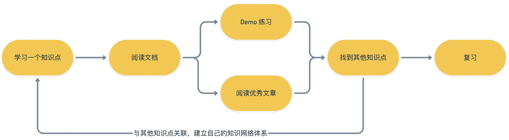

# 记录学习

## 学习方法

## 学习路线

- HTML
- CSS
- JavaScript
- Http

慢慢补充,其中`html` `css` `http` 处于工作和自身需要,优先级低于 `js` , 所以先学习 `js`,其余两项后面补充

## JavaScript 基础系列

1. [JavaScript 基础系列之数据类型](./src/javascript/基础系列/JavaScript基础系列之数据类型.md)
2. [JavaScript 基础系列之 typeof](./src/javascript/基础系列/JavaScript基础系列之typeof.md)
3. [JavaScript 基础系列之判断数组](./src/javascript/基础系列/JavaScript基础系列之判断数组.md)
4. [JavaScript 基础系列之 null 和 undefined](./src/javascript/基础系列/JavaScript基础系列之null和undefined.md)
5. [JavaScript 基础系列之==和===和类型转换](./src/javascript/基础系列/JavaScript基础系列之==和===和类型转换.md)
6. [JavaScript 基础系列之原始值和引用值](./src/javascript/基础系列/JavaScript基础系列之原始值和引用值.md)
7. [JavaScript 基础系列之原始值转换的抽象操作 toPrimitive](./src/javascript/基础系列/JavaScript基础系列之原始值转换的抽象操作toPrimitive.md)
8. [JavaScript 基础系列之 var-let-const](./src/javascript/基础系列/JavaScript基础系列之var-let-const.md)
9. [JavaScript 基础系列之 this 指向问题](./src/javascript/基础系列/JavaScript基础系列之this指向问题.md)
10. [JavaScript 基础系列之 apply-call-bind](./src/javascript/基础系列/JavaScript基础系列之apply-call-bind.md)
11. [JavaScript 基础系列之严格模式](./src/javascript/基础系列/JavaScript基础系列之严格模式.md)
12. [JavaScript 基础系列之 DOM 操作](./src/javascript/基础系列/JavaScript基础系列之DOM操作.md)
13. [JavaScript 基础系列之 JSON](./src/javascript/基础系列/JavaScript基础系列之JSON.md)
14. [JavaScript 基础系列之箭头函数](./src/javascript/基础系列/JavaScript基础系列之箭头函数.md)
15. [JavaScript 基础系列之 setTimeout 倒计时为什么会出现误差](./src/javascript/基础系列/JavaScript基础系列之setTimeout倒计时为什么会出现误差.md)

## JavaScript 深入系列 [主要学习记录于[冴羽大佬的博客](https://github.com/mqyqingfeng/Blog)]

1. [JavaScript 深入系列之浏览器如何获取和执行 JS 代码](./src/javascript/深入系列/JavaScript深入系列之浏览器如何获取和执行JS代码.md)
2. [JavaScript 深入系列之词法作用域和动态作用域](./src/javascript/深入系列/JavaScript深入系列之词法作用域和动态作用域.md)
3. [JavaScript 深入系列之执行上下文栈](./src/javascript/深入系列/JavaScript深入系列之执行上下文栈.md)
4. [JavaScript 深入系列之变量对象](./src/javascript/深入系列/JavaScript深入系列之变量对象.md)
5. [JavaScript 深入系列之作用域链](./src/javascript/深入系列/JavaScript深入系列之作用域链.md)
6. [JavaScript 深入系列之从 ECMAScript 规范解读 this](./src/javascript/深入系列/JavaScript深入系列之从ECMAScript规范解读this.md)
7. [JavaScript 深入系列之执行上下文](./src/javascript/深入系列/JavaScript深入系列之执行上下文.md)
8. [JavaScript 深入系列之参数按值传递](./src/javascript/深入系列/JavaScript深入系列之参数按值传递.md)
9. [JavaScript 深入系列之 call 和 apply 的模拟实现](./src/javascript/深入系列/JavaScript深入系列之call和apply的模拟实现.md)
10. [JavaScript 深入系列之 bind 的模拟实现](./src/javascript/深入系列/JavaScript深入系列之bind的模拟实现.md)
11. [JavaScript 深入系列之从原型到原型链](./src/javascript/深入系列/JavaScript深入系列之从原型到原型链.md)
12. [JavaScript 深入系列之 new 的模拟实现](./src/javascript/深入系列/JavaScript深入系列之new的模拟实现.md)
13. [JavaScript 深入系列之类数组对象与 arguments](./src/javascript/深入系列/JavaScript深入系列之类数组对象与arguments.md)
14. [JavaScript 深入系列之原型到原型链](./src/javascript/深入系列/JavaScript深入系列之原型到原型链.md)
15. [JavaScript 深入系列之创建对象的多种方式以及优缺点](./src/javascript/深入系列/JavaScript深入系列之创建对象的多种方式以及优缺点.md)
16. [JavaScript 深入系列之继承的多种方式和优缺点](./src/javascript/深入系列/JavaScript深入系列之继承的多种方式和优缺点.md)
17. [JavaScript 深入系列之类型转换规则](./src/javascript/深入系列/JavaScript深入系列之类型转换规则.md)
18. [JavaScript 深入系列之隐式类型转换](./src/javascript/深入系列/JavaScript深入系列之隐式类型转换.md)
