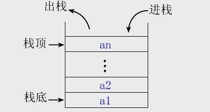

# 栈(Stack)

## 1.栈的基本概念

### 1.1 概念

只允许在一端进行插入或删除操作的线性表。首先，栈是一种线性表，但限定这种线性表只能在某一段进行插入和删除操作。

- 栈顶（Top）：线性表允许进行插入和删除的一端。

- 栈底（Bottom）：固定的，不允许进行插入和删除的另一端。

- 空栈：不含任何元素。

如上图：a1 为栈底元素，an 为栈顶元素。由于栈只能在栈顶进行插入和删除操作，故进栈次序依次为 a1，a2，... ,an 而出栈次序为 an，...，a2，a1。栈的明显的操作特征为后进先出（Last In First Out，LIFO）,故又称 后进先出的线性表。

## 2.栈的 Leetcode 练习

| leetcode 题号                                                                                                   | 解题思路 |
| :-------------------------------------------------------------------------------------------------------------- | -------- |
| [面试题 03.04. 化栈为队](https://leetcode-cn.com/problems/implement-queue-using-stacks-lcci/)                   |          |
| [682. 棒球比赛](https://leetcode-cn.com/problems/baseball-game/)                                                |          |
| [844. 比较含退格的字符串](https://leetcode-cn.com/problems/backspace-string-compare/)                           |          |
| [946. 验证栈序列](https://leetcode-cn.com/problems/validate-stack-sequences/)                                   |          |
| [20. 有效的括号](https://leetcode-cn.com/problems/valid-parentheses/)                                           |          |
| [1021. 删除最外层的括号](https://leetcode-cn.com/problems/remove-outermost-parentheses/)                        |          |
| [1249. 移除无效的括号](https://leetcode-cn.com/problems/minimum-remove-to-make-valid-parentheses/)              |          |
| [145. 二叉树的后序遍历](https://leetcode-cn.com/problems/binary-tree-postorder-traversal/)                      |          |
| [331. 验证二叉树的前序序列化](https://leetcode-cn.com/problems/verify-preorder-serialization-of-a-binary-tree/) |          |
| [227. 基本计算器 II](https://leetcode-cn.com/problems/basic-calculator-ii/)                                     |          |
| [636. 函数的独占时间](https://leetcode-cn.com/problems/exclusive-time-of-functions/)                            |          |
|                                                                                                                 |          |
|                                                                                                                 |          |
|                                                                                                                 |          |
