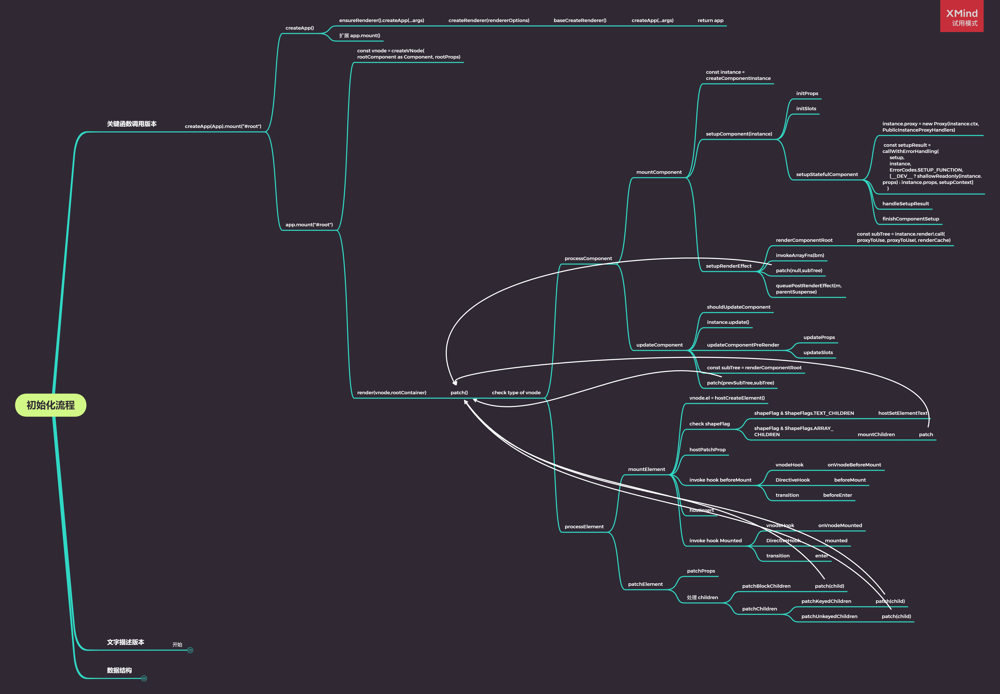

# mini-vue 之 runtime-core

> 大家好,我是自学前端的小菜鸟,目前工作不到一年,还在努力学习中,希望我写的内容,对你有帮助,也希望大家有什么意见和建议可以告诉我,让我少走弯路,谢谢啦!!
>
> 通过实现一个 `mini-vue3` 来加深自己对 `vue` 的理解,慢慢学习,记录自己所学,里面有详细注释
>
> 这个 `mini-vue3` 是通过 崔效瑞 的 git 仓库学习, **阮一峰老师** 推荐的学习 `vue3` 利器
>
> 本仓库地址: [mini-vue-impl](https://link.juejin.cn?target=https%3A%2F%2Fgithub.com%2Fjp-liu%2Fmini-vue-impl)
>
> 源码: [mini-vue](https://link.juejin.cn?target=https%3A%2F%2Fgithub.com%2Fcuixiaorui%2Fmini-vue)
>
> 纯粹自己学习，如有错误，还望大家指正，包含
>
> 
>
> 在学习仓库中[study-every-day](https://link.juejin.cn?target=https%3A%2F%2Fgithub.com%2Fjp-liu%2Fstudy-every-day),有大佬的脑图,需要的自取哦~

上期响应式系统的文章在这里

# 1.[响应式系统](https://juejin.cn/post/7040806312552169485)

# 2.核心运行时

说道核心运行时,还是一样先把 **`vue`** 的架构模式图看一下,看看他的作用


从图中,我们可以得知, `runtime-core` 是在我们的运行时中,起到承上启下的作用, 负责连接 `runtime-dom` 和 `reactivity` 响应式系统,达到跨平台的作用, 为什么会说跨平台呢?

这是因为`vue3` 提供了自定义渲染器, 我们可以根据不同的平台,提供不同的渲染器接口,达到跨平台渲染,可以做到这一点的主要原因也是因为, 采用的是虚拟节点, 渲染成真实节点,需要提供稳定 `API`,去帮我们将 节点渲染到页面上

例如: 浏览器 `DOM`

```js
// 创建一个节点并添加到 html 的body节点里面
const div = document.createElement('div')
div.textContent = 'Hello World'
document.body.append(div)
```

这个例子中我们就使用了浏览器的`DOM API` ,创建了一个节点,并添加到视图中

在小程序的 `wxml` 还有一些别的平台,只要提供稳定 `API` 就可以将我们的虚拟节点,转变成为真实的节点了

说到这里,我们也就知道了 `runtime-core` 所起到的作用了吧!~

1. 提供虚拟节点 `VNode`, 用于创建真实节点和 `diff` 比较更新
2. 提供自定义渲染器接口, 让用户可以根据平台创建渲染器
3. 调用 `reactivity` 模块,通过响应式系统的依赖收集, 来触发 `diff` 更新我们的视图

## 1.提供虚拟节点 `virtual DOM`

其实我之前一直都很疑惑的一点是, **虚拟节点**和**组件实例**之间的区别, 都是对象,都有对应的属性,有啥区别,直到这次我通过实现一个简版的,终于可以分清了

### 1.1 虚拟节点

虚拟节点是真实`DOM` 的一层镜像, 我们通过这一层镜像,来创建真实 `DOM`,并且实现更多优化上面的内容,比如说

**通过标记静态节点,做到更新的时候,更细小粒度的更新, 静态节点是永远不会动的,写死在哪里**

为什么需要`虚拟DOM` 呢?

1. 跨平台
2. 避免反复操作真实`DOM`造成不必要的性能消耗
3. 通过虚拟节点描述 `DOM` 树,可以通过 `diff` 精确的得知那一个点的更新, 进行更新,避免不必要的回流重绘等操作

> 虚拟 DOM 的核心就是用高效的 `JS` 操作，来减少低性能的 DOM 操作，以此来提升网页性能
>
> 其他平台,同理,后面都采用 `DOM` 作为描述点

看看代码

```ts
// vue3 中还会拥有很多属性,例如静态节点标记等等,可以再diff的时候直接跳过
export function createVNode(type, props?, children?) {
  const vnode = {
    type, // 节点类型
    props, // 属性
    children, // 子节点
    shapeFlag: getShapeFlag(type), // 虚拟节点类型
    el: null // 真实`DOM`引用,精确的`DOM`更新
  }

  if (typeof children === 'string') {
    // 子组件是文字,则将当前节点标注为,元素+文字
    vnode.shapeFlag |= ShapeFlag.TEXT_CHILDREN
  } else if (Array.isArray(children)) {
    // 子组件是数组,则有可能是新组件,或者元素子节点为,元素+子元素
    vnode.shapeFlag |= ShapeFlag.ARRAY_CHILDREN
  }

  // 是否有插槽
  if (
    vnode.shapeFlag & ShapeFlag.STATEFUL_COMPONENT &&
    typeof children === 'object'
  ) {
    vnode.shapeFlag |= ShapeFlag.SLOT_CHILDREN
  }

  return vnode
}
export function createTextVnode(text: string) {
  return createVNode(Text, {}, text) // 文本
}

/**
 * @description 获取当前子节点的类型标识符
 * @param type 当前`vnode`的类型
 */
function getShapeFlag(type: any) {
  return typeof type === 'string'
    ? ShapeFlag.ELEMENT // 元素
    : ShapeFlag.STATEFUL_COMPONENT // 组件
}
```

虚拟节点中,有一个位运算,大家肯定都听说过,通过二进制开关,来标记节点类型,确实是高,正常情况下,我们应该是采用 `map` 来判定类型,比如这样

```ts
const vnodeType = {
  element: false,
  stateful_component: false,
  text_children: false,
  array_children: false
}

// 组件如果是元素,子节点是文本
vnodeType.element = true
vnodeType.text_children = true

// 后续判定就会是这样
if (vnodeType.element && vnodeType.text_children) {
  // 相关操作
}
```

其实这样的可读性很高,不过性能就比较差了,我们每个虚拟节点都需要一个映射对象,然后创建的时候进行标记,而且开辟影射对象存储,判定的消费就高了,相反我们使用二进制位开关来表示,就会快的多,存的数字,消耗空间小,二进制更适合电脑快速解析

看看 `vue3` 是如何做的

```tsx
/**
 * 虚拟节点类型标识符
 * 每一个二进制位,代表一种类型
 */
export const enum ShapeFlag {
  ELEMENT = 1, // 0001 元素
  STATEFUL_COMPONENT = 1 << 1, // 0010 组件
  TEXT_CHILDREN = 1 << 2, // 0100 子节点是文本
  ARRAY_CHILDREN = 1 << 3, // 1000 子节点是数组
  SLOT_CHILDREN = 1 << 4 // 1 0000 组件使用了插槽
}

// 关于类型的判断,采用 | 和 & 来操作
// 创建节点的时候,通过 |= 来开启对应的标识位
// 判断的时候,通过 & 来表示位的标识,同位 1 & 才为 1
```

## 2. 提供渲染器接口

渲染器接口的提供倒不是难事, 将操作节点的`API`通过闭包的方式进行传入,达到的效果需要就是, 在虚拟节点需要创建真实节点的时候,调用传入的稳定 `API`

```ts
/**
 * @description 通过外部定义创建渲染器,达到渲染不同平台元素
 * @param options 元素节点处理提供的接口
 */
export function createRenderer(options) {
  // 提供自定义渲染接口
  const {
    createElement: hostCreateElement, // 创建操作
    patchProp: hostPatchProp, // 属性操作
    insert: hostInsert, // 插入操作
    createTextNode: hostCreateTextNode // 文本操作
  } = options

  // ... 虚拟节点,组件的相关操作

  return {
    // 将入口提供暴露
    createApp: createAppAPI(render)
  }
}

export function createAppAPI(render) {
  return function createApp(rootComponent) {
    return {
      mount(rootContainer) {
        // 1.将组件或者`Dom`转换成为虚拟节点
        const vnode = createVNode(rootComponent)

        // 2.处理`vnode`
        render(vnode, rootContainer)
      }
    }
  }
}
```

### 2.1 渲染器核心 **`patch`**

渲染器为我们提供了处理虚拟节点的能力, 让我们可以通过外部接口,创建和修改真实节点的属性和内容,说道创建和修改,那么我们是如何知道什么时候创建,什么时候修改的呢?

这就要说道 `patch` 这个方法,还有我们的 `diff` 算法了

1. 启动方法

   ```ts
   // 提供给外部的启动渲染方法
   function render(vnode, rootContainer: HTMLElement) {
     // 渲染器入口，从这里开始递归处理节点
     patch(null, vnode, rootContainer, null, null)
   }

   return {
     createApp: createAppAPI(render) // 对外暴露启动渲染的方法
   }
   ```

2. `patch` 对不同类型做不同处理

   - 当 `n1` 是 `null` 的时候,说明没有旧节点,这个时候就需要创建

   - 当 `n1` 不为 `null` 的时候,说明是两个节点需要对比更新

   ```ts
   /**
    * @description 比较新旧节点,进行创建和修改操作
    * @param n1 旧节点
    * @param n2 新节点
    * @param container 节点容器
    * @param parentComponent 父组件
    * @param anchor 节点插入的锚点
    */
   function patch(n1, n2, container, parentComponent, anchor) {
     const { type, shapeFlag } = n2

     switch (type) {
       // 分段节点(不需要容器的无根节点)
       case Fragment:
         processFragment(n1, n2, container, parentComponent, anchor)
         break
       // 文本节点
       case Text:
         processText(n1, n2, container, anchor)
         break

       default:
         // 1.判断类型,进行不同操作
         if (shapeFlag & ShapeFlag.ELEMENT) {
           // 1.1 元素
           processElement(n1, n2, container, parentComponent, anchor)
         } else if (shapeFlag & ShapeFlag.STATEFUL_COMPONENT) {
           // 1.2 组件
           processComponent(n1, n2, container, parentComponent, anchor)
         }
         break
     }
   }
   ```

3. 组件驱动,我们平时写的一个个`.vue`文件都是一个个组件,我们通过响应式系统,处理更新视图,都是会触发组件的 `render` 函数,进行差异化的 `diff` 算法比较,然后精准更新

   > 注意这里的 `render` 函数,和启动器的 `render` 是不一样的
   >
   > - 启动器的渲染函数是开始程序,只会调用一次
   > - 组件的 `render` 函数,是创建`虚拟DOM` 的,会随着响应式数据的变更,而频繁的调用

   组件的创建核心流程,开篇的思维导图已经很详细了,说道这,我们该进入真正的比较了

上面说的启动和组件,都是我们的初始化流程,现在说下,当数据改变,我们的视图需要更新的时候, `patch` 的运行逻辑

#### 第一步: 响应式数据变更,触发 `patch`

```ts
function setupRenderEffect(instance, container, anchor) {
  effect(() => {
    // @Tips: 第一次加载
    if (!instance.isMounted) {
      // 1.调用渲染函数,获取组件虚拟节点树,绑定`this`为代理对象,实现`render`函数中访问组件状态
      const subTree = instance.render.call(instance.proxy, h)

      // 2.继续`patch`,递归挂载组件
      patch(null, subTree, container, instance, anchor)

      // 3.组件实例绑定`el`用于后续`patch`精准更新
      instance.vnode.el = subTree.el

      // 4.存放旧虚拟节点树,后续`patch`调用
      instance.subTree = subTree

      // 5.标识已挂载
      instance.isMounted = true
    }
    // @Tips: 更新
    else {
      // 1.获取到新的虚拟节点树
      const subTree = instance.render.call(instance.proxy, h)

      // 2.获取旧的虚拟节点树
      const prevSubTree = instance.subTree

      // 3.`patch`更新页面
      patch(prevSubTree, subTree, container, instance, anchor)

      // 4.对比完后新树变旧树
      instance.subTree = subTree
    }
  })
}
```

#### 第二步: 进入更新逻辑

```ts
function processElement(n1, n2: any, container: any, parentComponent, anchor) {
  if (!n1) {
    // 1.挂载元素
    mountElement(n2, container, parentComponent, anchor)
  } else {
    // 2.更新元素
    patchElement(n1, n2, parentComponent, anchor)
  }
}
```

#### 第三步: 深度优先处理子节点

```ts
function patchElement(n1, n2, parentComponent, anchor) {
  // 1.从旧节点中获取之前的`DOM`并在新节点中赋值,新节点下次就是旧的了
  const el = (n2.el = n1.el)
  console.log('旧虚拟节点:', n1)
  console.log('新虚拟节点:', n2)
  // 2.深度优先,先处理子节点
  patchChildren(n1, n2, el, parentComponent, anchor)

  // 3.更新属性
  const oldProps = n1.props || {}
  const newProps = n2.props || {}
  patchProps(el, oldProps, newProps)
}
```

#### 第四步: 枚举更新的情况,做不同处理

```ts
function patchChildren(n1, n2, container, parentComponent, anchor) {
  // 1.获取旧节点的类型和子节点
  const { shapeFlag: prevShapeFlag, children: prevChildren } = n1
  // 2.获取新节点的类型和子节点
  const { shapeFlag: nextShapeFlag, children: nextChildren } = n2

  /**
   * 新旧节点类型枚举
   *  1.  新: 文本  ==> 旧: 文本  ==> 更新文本内容
   *                    旧: 数组  ==> 卸载节点替换为文本
   *
   *  2.  新: 数组  ==> 旧: 文本  ==> 清空文本挂载新节点
   *                    旧: 数组  ==> 双端对比算法
   *
   * 只有最后一种情况存在双端对比算法,上面情况都是比较好处理的情况
   */
  // 1.新节点是文本节点, => 卸载节点 || 替换文本
  if (nextShapeFlag & ShapeFlag.TEXT_CHILDREN) {
    if (prevShapeFlag & ShapeFlag.ARRAY_CHILDREN) {
      unmountChildren(n1.children)
    }
    if (prevChildren !== nextChildren) {
      hostSetElementText(container, nextChildren)
    }
  }
  // 2.新节点是数组节点, => 挂载新节点 || 双端对比
  else {
    if (prevShapeFlag & ShapeFlag.TEXT_CHILDREN) {
      hostSetElementText(container, '')
      mountChildren(nextChildren, container, parentComponent, anchor)
    } else {
      // 双端对比
      patchKeyedChildren(
        prevChildren,
        nextChildren,
        container,
        parentComponent,
        anchor
      )
    }
  }
}
```

#### 第五步: 最坏情况 - 双端对比算法

这里有一点需要注意,这里的最简版实现中,我们是采用的带 `key` 的双端对比算法, 不带 `key` 的话,我们无法判别两个虚拟节点,新的是不是之前同一个,所以使用的比较方式也比较无脑, 直接就是 `for` 循环, 多的卸载, 少的创建,所以这里先不做实现了

先看下 `vue-next` 源码就好

##### 5.1 没有 `key` 的 `diff`

```ts
const patchUnkeyedChildren = (
  c1: VNode[],
  c2: VNodeArrayChildren,
  container: RendererElement,
  anchor: RendererNode | null,
  parentComponent: ComponentInternalInstance | null,
  parentSuspense: SuspenseBoundary | null,
  isSVG: boolean,
  slotScopeIds: string[] | null,
  optimized: boolean
) => {
  c1 = c1 || EMPTY_ARR
  c2 = c2 || EMPTY_ARR
  const oldLength = c1.length
  const newLength = c2.length
  const commonLength = Math.min(oldLength, newLength)
  let i
  for (i = 0; i < commonLength; i++) {
    const nextChild = (c2[i] = optimized
      ? cloneIfMounted(c2[i] as VNode)
      : normalizeVNode(c2[i]))
    patch(
      c1[i],
      nextChild,
      container,
      null,
      parentComponent,
      parentSuspense,
      isSVG,
      slotScopeIds,
      optimized
    )
  }
  if (oldLength > newLength) {
    // 旧的多,则卸载掉
    unmountChildren(
      c1,
      parentComponent,
      parentSuspense,
      true,
      false,
      commonLength
    )
  } else {
    // 新的多,则创建
    mountChildren(
      c2,
      container,
      anchor,
      parentComponent,
      parentSuspense,
      isSVG,
      slotScopeIds,
      optimized,
      commonLength
    )
  }
}
```

##### 5.2 有 `key` 的 `diff`

双端对比算法:

    从两侧分别进行扫描,求得中间乱序部分,进行特殊判断处理

1. 从左往右进行依次比较,相同则进行 递归 `patch` 不同,则结束
2. 从右向左
3. 扫描结束,求得新节点比旧节点数量多的处理
4. 扫描结束,求得旧节点比新节点数量多的处理
5. 扫描结束,暂时不知道谁多谁少的移动处理

从 1,2 的得知,我们需要对比双端的位置, 所以我们需要新旧节点的下标信息,但是,两个数组长度可能不一致,所以我们需要设置三个游标,分别是

1. 从头开始的 `i` ,不管数组怎么变, 下标都是从 `0` 开始, 所以头游标只需要一个
2. 旧节点尾部游标 `e1`
3. 新节点尾部游标 `e2`

> 数组长度不一致,所以需要同时比较两个尾部, 需要两个游标分别指向尾元素

```ts
// 设置对比游标
const l2 = c2.length
let i = 0
let e1 = c1.length - 1
let e2 = c2.length - 1

// 创建辅助函数,判断两个节点是否同一个节点
// 同一个节点就可以进行递归比较了,不是同一个,则不是删除就是创建
function isSameNodeVNodeType(c1, c2) {
  return c1.type === c2.type && c1.key === c2.key
}
```

###### 5.2.1.从左向右扫描

```ts
// (a b)
// (a b) c
// 1.从左侧向右开始对比
while (i <= e1 && i <= e2) {
  const n1 = c1[i]
  const n2 = c2[i]
  // 判断是否同一个节点,进行比较
  if (isSameNodeVNodeType(n1, n2)) {
    patch(n1, n2, container, parentComponent, anchor)
  } else {
    break
  }
  i++
}
```

###### 5.2.2 从右向左扫描

```ts
//   (b c)
// e (b c)
// 2.从右侧向左开始对比
while (i <= e1 && i <= e2) {
  const n1 = c1[e1]
  const n2 = c2[e2]
  // 判断是否同一个节点,进行比较
  if (isSameNodeVNodeType(n1, n2)) {
    patch(n1, n2, container, parentComponent, anchor)
  } else {
    break
  }
  e1--
  e2--
}
```

###### 5.2.3 扫描结束,新多,旧少

```ts
// 3.新的比老得多
// 3.1 后面新增
// (a b)
// (a b) c
// i:2  e1:1  e2:2
// 3.2 前面新增
//   (a b)
// c (a b)
// i:0  e1:-1  e2:0
if (i > e1) {
  if (i <= e2) {
    // 前面新增,需要提供锚点,为 a,
    // e2 + 1 < l2 说明 e2 在向左推进,右侧全部相同处理完毕,取 e2 右侧第一个
    const nextPos = e2 + 1
    const anchor = nextPos < l2 ? c2[nextPos].el : null
    while (i <= e2) {
      patch(null, c2[i], container, parentComponent, anchor)
      i++
    }
  }
}
```

###### 5.2.4 扫描结束, 新少,旧多

```ts
// 4.老的比新的多
// (a b) c d
// (a b)
// i:2  e1:3  e2:1
//  c d (a b)
//      (a b)
// i:0  e1:1  e2:-1
else if (i > e2) {
  while (i <= e1) {
    // 当旧的多的时候,前后游标之间都是要卸载的元素
    hostRemove(c1[i].el)
    i++
  }
}
```

###### 5.2.5 扫描结束,乱序部分

```ts
// 5.中间乱序部分
// [i ... e1 + 1]: a b [c d e] f g
// [i ... e2 + 1]: a b [e d c h] f g
// i = 2, e1 = 4, e2 = 5
else {
  // 重新记录两组节点的起点
  const s1 = i // prev starting index
  const s2 = i // next starting index

  // 5.1 创建新节点的索引映射表
  //     便于旧节点遍历时,判断是否存在于新节点
  const keyTonewIndexMap = new Map()
  for (let i = s2; i <= e2; i++) {
    const nextChild = c2[i]
    if (nextChild.key != null) {
      keyTonewIndexMap.set(nextChild.key, i)
    }
  }

  // 5.2 遍历旧节点,判断在新节点中是否存在,做特定处理
  let patched = 0 // 旧节点已处理个数
  const toBePatched = e2 - s2 + 1 // 新节点需要处理总数量

  // 创建新节点对旧节点位置映射,用于判断节点是否需要移动
  // 并且使用最长递增子序列,优化移动逻辑,没有移动的节点,下标是连续的
  // a,b,(c,d,e),f,g
  // a,b,(e,c,d),f,g
  // c d 无需移动，移动 e 即可
  // 节点是否移动,移动就需要计算最长递增子序列,如果没移动,则直接不需要计算了
  let moved = false
  let maxNewIndexSoFar = 0 //
  const newIndexToOldIndexMap = new Array(toBePatched)
  // 初始化 0,表示旧在新中都不存在
  for (let i = 0; i < toBePatched; i++) newIndexToOldIndexMap[i] = 0

  for (let i = s1; i <= e1; i++) {
    const prevChild = c1[i]

    // 当新节点对比完了,剩下的都需要卸载
    // [i ... e1 + 1]: a b [c d h] f g
    // [i ... e2 + 1]: a b [d c] f g
    // d c 处理之后, h 是多的,需要卸载,无需后续比较,优化
    // patched >= toBePatched 说明处理节点数超过新节点数量,剩余的都是旧的多余的
    if (patched >= toBePatched) {
      hostRemove(prevChild.el)
      continue
    }

    // 获取旧节点在新节点的位置
    let newIndex
    if (prevChild.key != null) {
      newIndex = keyTonewIndexMap.get(prevChild.key)
    } else {
      for (let j = s2; j <= e2; j++) {
        if (isSameNodeVNodeType(c1[i], c2[j])) {
          newIndex = j
          break
        }
      }
    }

    // newIndex 不存在,则说明旧节点在新节点中不存在
    if (newIndex === undefined) {
      hostRemove(c1[i].el)
    } else {
      // 是否移动位置
      if (newIndex >= maxNewIndexSoFar) {
        maxNewIndexSoFar = newIndex
      } else {
        moved = true
      }

      // 记录旧节点在新节点的下标映射,这里说明新旧节点都存在,需要进行递归比较
      // newIndex - s2 起点从0开始,但是要知道是新节点的第几个
      // i + 1 i有可能为0,不能为0,0表示没有映射关系,新节点中没有这个旧节点
      newIndexToOldIndexMap[newIndex - s2] = i + 1

      patch(prevChild, c2[newIndex], container, parentComponent, null)
      // 对比一个节点,新`VNode`中旧少一个需要对比的
      patched++
    }
  }

  // 获取最长递增子序列
  const increasingNewIndexSequence = moved
    ? getSequence(newIndexToOldIndexMap)
    : []
  let j = increasingNewIndexSequence.length - 1
  for (let i = toBePatched - 1; i >= 0; i--) {
    const nextIndex = i + s2
    const nextChild = c2[nextIndex]
    const anchor = nextIndex + 1 < l2 ? c2[nextIndex + 1].el : null

    // 0 表示在旧节点遍历的时候,没找到,是需要新创建的
    if (newIndexToOldIndexMap[i] === 0) {
      patch(null, nextChild, container, parentComponent, anchor)
    }
    // 不为 0 则表示旧节点在新节点中存在, 判断是否需要移动位置
    else if (moved) {
      // 不在最长递增子序列中,说明,为了大局,他需要被移动
      // a,b,(c,d,e),f,g
      // a,b,(e,c,d),f,g
      // 最长子序列其实也就是连续的稳定的没动的节点,这里是 c d 他俩的兄弟关系没动,只需要移动 e
      if (j < 0 || i !== increasingNewIndexSequence[j]) {
        console.log('移动位置')
        hostInsert(nextChild.el, container, anchor)
      } else {
        j--
      }
    }
  }
}
```

在 `vue3` 中大家都听过这个,`最长递增子序列` 的算法,学这个估计有些难度,不过可以去研究研究,不过到这里,我们还是要知道,这个算法在帮助我们解决什么问题

1. 计算出一个稳定序列,让我们能够大幅度减少,操作 `DOM` 的性能消耗,毕竟操作使用`V8` 操作 `JS` 远比操作原生 `DOM` 的消耗少的多,也快的多

### 2.2 总结

1. 我们知道了日常中的 `key` 在我们的 `vue` 中为何会如此重要

   他在我们的 `对比` 算法中,起到了至关重要的作用,我们的由单纯的 `for` 循环,遇到不同就就卸载旧元素,创建新元素, 变为了,两个 `DOM` 的精准内容比较, 这无疑是节约了大部分的性能

2. 关于最长递增子序列,在`vue3` 中的应用,到底解决了什么问题

   尽最大能力,减少操作 `DOM` 的次数

## 3. 组件实例对象

刚刚有说过,之前就分不清组件对象和虚拟节点对象的区别,上面说了虚拟节点,接下来看看组件实例

组件实例对象,其实是我平时操作的 `.vue` 文件导出的整个对象,我们正常的可操作文档 `API` 都在组件实例上拥有定义,是我们操作视图的交互和呈现的一个抽象,因为组件内需要做的事情很多,我们可以抽象出来一个对象,帮助我们完成这些事情

看看代码:

```ts
export function createComponentInstance(vnode, parent) {
  const component: any = {
    vnode, // 组件对应虚拟节点
    type: vnode.type, // 组件类型 => 就是我们提供给组件的配置信息,如: { name: 'App, setup... }
    setupState: {}, // setup 返回的状态信息
    props: {}, // 组件属性信息,就是上级组件传递的内容
    slots: {}, // 插槽
    provides: parent ? parent.provides : {}, // provide/inject功能
    parent, // 组件的父级组件
    isMounted: false, // 是否挂载的标识
    subTree: null, // 组件节点树,用于 diff
    emit: () => {} // emit 功能的实现
  }

  component.emit = emit

  return component
}
```

看到这些功能 `API` 就应该都清楚了吧,组件实例是我们编写组件,提供操作的一个状态存储中心,记录了我们组件当前的状态,而虚拟节点是当前 `真实DOM` 的一个映射

## 4. 调用响应式系统

```ts
function setupRenderEffect(instance, container) {
  // 通过 `effect` 调用组件的渲染函数
  // 当我们在组件中使用 `ref/reactive` 这些响应式对象的时候,就会触发依赖收集
  // 当依赖发生改变的时候,重新调用当前函数,就会触发 `patch` 进行 `diff` 算法比较,更新到视图
  // 组件级别的依赖收集,避免性能浪费
  effect(() => {
    // @Tips: 第一次加载
    if (!instance.isMounted) {
      // 1.调用渲染函数,获取组件虚拟节点树,绑定`this`为代理对象,实现`render`函数中访问组件状态
      const subTree = instance.render.call(instance.proxy, h)

      // 2.继续`patch`,递归挂载组件
      patch(null, subTree, container, instance)

      // 3.组件实例绑定`el`用于后续`patch`精准更新
      instance.vnode.el = subTree.el

      // 4.存放旧虚拟节点树,后续`patch`调用
      instance.subTree = subTree

      // 5.标识已挂载
      instance.isMounted = true
    }
    // @Tips: 更新
    else {
      // 1.获取到新的虚拟节点树
      const subTree = instance.render.call(instance.proxy, h)

      // 2.获取旧的虚拟节点树
      const prevSubTree = instance.subTree

      // 3.`patch`更新页面
      patch(prevSubTree, subTree, container, instance)

      // 4.对比完后新树变旧树
      instance.subTree = subTree
    }
  })
}
```

到这里就结束了,谢谢大家的观看

**仓库地址**: [mini-vue-impl](https://github.com/jp-liu/mini-vue-impl)

欢迎大家指正:一起学习

大家也可以去实现一个简版,或者去我的仓库看看, `commit` 记录都是对应的, 这周我会打上对应的 `tag` 方便阅读和复习, 希望大家喜欢,喜欢的话给一个 `star` 呦,谢谢啦
