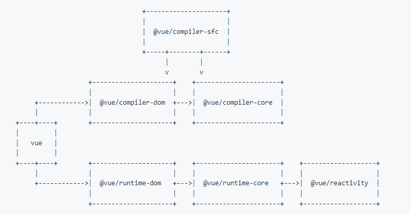

# mini-vue 之 runtime-core

> 大家好,我是自学前端的小菜鸟,目前工作不到一年,还在努力学习中,希望我写的内容,对你有帮助,也希望大家有什么意见和建议可以告诉我,让我少走弯路,谢谢啦!!
>
> 通过实现一个 `mini-vue3` 来加深自己对 `vue` 的理解,慢慢学习,记录自己所学,里面有详细注释
>
> 这个 `mini-vue3` 是通过 崔效瑞 的 git 仓库学习, **阮一峰老师** 推荐的学习 `vue3` 利器
>
> 本仓库地址: [mini-vue-impl](https://link.juejin.cn?target=https%3A%2F%2Fgithub.com%2Fjp-liu%2Fmini-vue-impl)
>
> 源码: [mini-vue](https://link.juejin.cn?target=https%3A%2F%2Fgithub.com%2Fcuixiaorui%2Fmini-vue)
>
> 纯粹自己学习，如有错误，还望大家指正，包含
>
> 
>
> 在学习仓库中[study-every-day](https://link.juejin.cn?target=https%3A%2F%2Fgithub.com%2Fjp-liu%2Fstudy-every-day),有大佬的脑图,需要的自取哦~

上期响应式系统的文章在这里

# 1.[响应式系统](https://juejin.cn/post/7040806312552169485)

# 2.核心运行时

说道核心运行时,还是一样先把 **`vue`** 的架构模式图看一下,看看他的作用



从图中,我们可以得知, `runtime-core` 是在我们的运行时中,起到承上启下的作用, 负责连接 `runtime-dom` 和 `reactivity` 响应式系统,达到跨平台的作用, 为什么会说跨平台呢?

这是因为`vue3` 提供了自定义渲染器, 我们可以根据不同的平台,提供不同的渲染器接口,达到跨平台渲染,可以做到这一点的主要原因也是因为, 采用的是虚拟节点, 渲染成真实节点,需要提供稳定 `API`,去帮我们将 节点渲染到页面上

例如: 浏览器 `DOM`

```js
// 创建一个节点并添加到 html 的body节点里面
const div = document.createElement('div')
div.textContent = 'Hello World'
document.body.append(div)
```

这个例子中我们就使用了浏览器的`DOM API` ,创建了一个节点,并添加到视图中

在小程序的 `wxml` 还有一些别的平台,只要提供稳定 `API` 就可以将我们的虚拟节点,转变成为真实的节点了

说到这里,我们也就知道了 `runtime-core` 所起到的作用了吧!~

1. 提供虚拟节点 `VNode`, 用于创建真实节点和 `diff` 比较更新
2. 提供自定义渲染器接口, 让用户可以根据平台创建渲染器
3. 调用 `reactivity` 模块,通过响应式系统的依赖收集, 来触发 `diff` 更新我们的视图

## 1.提供虚拟节点 `virtual DOM`

其实我之前一直都很疑惑的一点是, **虚拟节点**和**组件实例**之间的区别, 都是对象,都有对应的属性,有啥区别,直到这次我通过实现一个简版的,终于可以分清了

### 1.1 虚拟节点

虚拟节点是真实`DOM` 的一层镜像, 我们通过这一层镜像,来创建真实 `DOM`,并且实现更多优化上面的内容,比如说

**通过标记静态节点,做到更新的时候,更细小粒度的更新, 静态节点是永远不会动的,写死在哪里**

为什么需要`虚拟DOM` 呢?

1. 跨平台
2. 避免反复操作真实`DOM`造成不必要的性能消耗
3. 通过虚拟节点描述 `DOM` 树,可以通过 `diff` 精确的得知那一个点的更新, 进行更新,避免不必要的回流重绘等操作

> 虚拟 DOM 的核心就是用高效的 `JS` 操作，来减少低性能的 DOM 操作，以此来提升网页性能
>
> 其他平台,同理,后面都采用 `DOM` 作为描述点

看看代码

```ts
// vue3 中还会拥有很多属性,例如静态节点标记等等,可以再diff的时候直接跳过
export function createVNode(type, props?, children?) {
  const vnode = {
    type, // 节点类型
    props, // 属性
    children, // 子节点
    shapeFlag: getShapeFlag(type), // 虚拟节点类型
    el: null // 真实`DOM`引用,精确的`DOM`更新
  }

  if (typeof children === 'string') {
    // 子组件是文字,则将当前节点标注为,元素+文字
    vnode.shapeFlag |= ShapeFlag.TEXT_CHILDREN
  } else if (Array.isArray(children)) {
    // 子组件是数组,则有可能是新组件,或者元素子节点为,元素+子元素
    vnode.shapeFlag |= ShapeFlag.ARRAY_CHILDREN
  }

  // 是否有插槽
  if (
    vnode.shapeFlag & ShapeFlag.STATEFUL_COMPONENT &&
    typeof children === 'object'
  ) {
    vnode.shapeFlag |= ShapeFlag.SLOT_CHILDREN
  }

  return vnode
}
export function createTextVnode(text: string) {
  return createVNode(Text, {}, text) // 文本
}

/**
 * @description 获取当前子节点的类型标识符
 * @param type 当前`vnode`的类型
 */
function getShapeFlag(type: any) {
  return typeof type === 'string'
    ? ShapeFlag.ELEMENT // 元素
    : ShapeFlag.STATEFUL_COMPONENT // 组件
}
```

虚拟节点中,有一个位运算,大家肯定都听说过,通过二进制开关,来标记节点类型,确实是高,正常情况下,我们应该是采用 `map` 来判定类型,比如这样

```ts
const vnodeType = {
  element: false,
  stateful_component: false,
  text_children: false,
  array_children: false
}

// 组件如果是元素,子节点是文本
vnodeType.element = true
vnodeType.text_children = true

// 后续判定就会是这样
if (vnodeType.element && vnodeType.text_children) {
  // 相关操作
}
```

其实这样的可读性很高,不过性能就比较差了,我们每个虚拟节点都需要一个映射对象,然后创建的时候进行标记,而且开辟影射对象存储,判定的消费就高了,相反我们使用二进制位开关来表示,就会快的多,存的数字,消耗空间小,二进制更适合电脑快速解析

看看 `vue3` 是如何做的

```tsx
/**
 * 虚拟节点类型标识符
 * 每一个二进制位,代表一种类型
 */
export const enum ShapeFlag {
  ELEMENT = 1, // 0001 元素
  STATEFUL_COMPONENT = 1 << 1, // 0010 组件
  TEXT_CHILDREN = 1 << 2, // 0100 子节点是文本
  ARRAY_CHILDREN = 1 << 3, // 1000 子节点是数组
  SLOT_CHILDREN = 1 << 4 // 1 0000 组件使用了插槽
}

// 关于类型的判断,采用 | 和 & 来操作
// 创建节点的时候,通过 |= 来开启对应的标识位
// 判断的时候,通过 & 来表示位的标识,同位 1 & 才为 1
```

## 2. 提供渲染器接口

渲染器接口的提供倒不是难事, 将操作节点的`API`通过闭包的方式进行传入,达到的效果需要就是, 在虚拟节点需要创建真实节点的时候,调用传入的稳定 `API`

```ts
/**
 * @description 通过外部定义创建渲染器,达到渲染不同平台元素
 * @param options 元素节点处理提供的接口
 */
export function createRenderer(options) {
  // 提供自定义渲染接口
  const {
    createElement: hostCreateElement, // 创建操作
    patchProp: hostPatchProp, // 属性操作
    insert: hostInsert, // 插入操作
    createTextNode: hostCreateTextNode // 文本操作
  } = options

  // ... 虚拟节点,组件的相关操作

  return {
    // 将入口提供暴露
    createApp: createAppAPI(render)
  }
}

export function createAppAPI(render) {
  return function createApp(rootComponent) {
    return {
      mount(rootContainer) {
        // 1.将组件或者`Dom`转换成为虚拟节点
        const vnode = createVNode(rootComponent)

        // 2.处理`vnode`
        render(vnode, rootContainer)
      }
    }
  }
}
```

## 3. 组件实例对象

刚刚有说过,之前就分不清组件对象和虚拟节点对象的区别,上面说了虚拟节点,接下来看看组件实例

组件实例对象,其实是我平时操作的 `.vue` 文件导出的整个对象,我们正常的可操作文档 `API` 都在组件实例上拥有定义,是我们操作视图的交互和呈现的一个抽象,因为组件内需要做的事情很多,我们可以抽象出来一个对象,帮助我们完成这些事情

看看代码:

```ts
export function createComponentInstance(vnode, parent) {
  const component: any = {
    vnode, // 组件对应虚拟节点
    type: vnode.type, // 组件类型 => 就是我们提供给组件的配置信息,如: { name: 'App, setup... }
    setupState: {}, // setup 返回的状态信息
    props: {}, // 组件属性信息,就是上级组件传递的内容
    slots: {}, // 插槽
    provides: parent ? parent.provides : {}, // provide/inject功能
    parent, // 组件的父级组件
    isMounted: false, // 是否挂载的标识
    subTree: null, // 组件节点树,用于 diff
    emit: () => {} // emit 功能的实现
  }

  component.emit = emit

  return component
}
```

看到这些功能 `API` 就应该都清楚了吧,组件实例是我们编写组件,提供操作的一个状态存储中心,记录了我们组件当前的状态,而虚拟节点是当前 `真实DOM` 的一个映射

## 4. 调用响应式系统

```ts
function setupRenderEffect(instance, container) {
  // 通过 `effect` 调用组件的渲染函数
  // 当我们在组件中使用 `ref/reactive` 这些响应式对象的时候,就会触发依赖收集
  // 当依赖发生改变的时候,重新调用当前函数,就会触发 `patch` 进行 `diff` 算法比较,更新到视图
  // 组件级别的依赖收集,避免性能浪费
  effect(() => {
    // @Tips: 第一次加载
    if (!instance.isMounted) {
      // 1.调用渲染函数,获取组件虚拟节点树,绑定`this`为代理对象,实现`render`函数中访问组件状态
      const subTree = instance.render.call(instance.proxy, h)

      // 2.继续`patch`,递归挂载组件
      patch(null, subTree, container, instance)

      // 3.组件实例绑定`el`用于后续`patch`精准更新
      instance.vnode.el = subTree.el

      // 4.存放旧虚拟节点树,后续`patch`调用
      instance.subTree = subTree

      // 5.标识已挂载
      instance.isMounted = true
    }
    // @Tips: 更新
    else {
      // 1.获取到新的虚拟节点树
      const subTree = instance.render.call(instance.proxy, h)

      // 2.获取旧的虚拟节点树
      const prevSubTree = instance.subTree

      // 3.`patch`更新页面
      patch(prevSubTree, subTree, container, instance)

      // 4.对比完后新树变旧树
      instance.subTree = subTree
    }
  })
}
```

到这里就结束了,谢谢大家的观看

**仓库地址**: [mini-vue-impl](https://github.com/jp-liu/mini-vue-impl)

欢迎大家指正:一起学习

大家也可以去实现一个简版,或者去我的仓库看看, `commit` 记录都是对应的, 这周我会打上对应的 `tag` 方便阅读和复习, 希望大家喜欢,喜欢的话给一个 `star` 呦,谢谢啦
